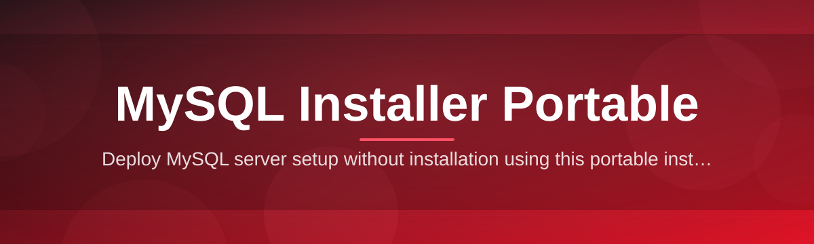

# mysql-installer-configurator 🐬⚙️

  

*One portable executable that sets up, configures, and validates a working MySQL instance in the time it takes to make coffee.*

---

## 📋 The Old Way vs. The New Way

Setting up MySQL on Windows has traditionally meant wrestling with wizards, orphaned services, and configuration files that only make sense to the person who wrote them. Here's the honest comparison:

| | Legacy MySQL Installer | mysql-installer-configurator |
|---|---|---|
| **Setup time** | 20-40 minutes, multiple reboots | Under 3 minutes, zero reboots |
| **Dependencies** | .NET runtimes, VC++ redistributables, online downloader stubs | None — fully self-contained |
| **Install footprint** | Registry sprawl, hidden services, leftover installers | Single portable folder, nothing left behind |
| **Configuration** | Manual `my.ini` editing, guesswork on ports/charset | Guided config profiles, sane defaults baked in |
| **Uninstall** | Control Panel roulette, residual files | Delete the folder. Done. |
| **Admin rights** | Usually required | Optional, runs in user-mode too |
| **Offline use** | Needs internet for the web installer variant | Works fully offline once downloaded |

> [!NOTE]
> This isn't a fork of Oracle's installer — it's a ground-up rebuild focused on the 80% of setup steps that are always the same, so you stop repeating yourself every time you spin up a new MySQL environment.

---

## 🧭 Overview

**mysql-installer-configurator** is a portable MySQL Installer and configuration toolkit built for developers, sysadmins, and QA engineers who need a working MySQL server *now*, not after reading a changelog and clicking through six wizard screens. It bundles the MySQL server binaries, a configuration engine, and a validation layer into a single portable package that runs directly from a USB stick, a network share, or your Downloads folder — no system-wide install required.

The project exists because the standard MySQL installation experience on Windows was designed for a world of dedicated database administrators provisioning one server a year. That's not how most of us work in 2026. We spin up local databases for testing, tear down environments between client projects, and often need MySQL running on machines where we don't have (or want) full admin control. This tool treats MySQL setup like a disposable, repeatable operation instead of a ceremony.

It's built for solo developers shipping side projects, teams standardizing local dev environments, students learning database administration without breaking their host OS, and anyone who has ever muttered "why is this still asking me for a root password screen" at 2 AM. If you've ever needed a MySQL Installer Portable solution that just *works* without phoning home or leaving traces across your registry, this is that tool.

  

---

## 🚀 What It Actually Does

- **Portable-first architecture** — the entire MySQL server, config engine, and control panel run from one folder. Copy it, move it, run it from a USB drive between machines without reinstalling anything.

- **Zero-dependency execution** — no .NET installer prompts, no Visual C++ redistributable chase, no "please restart your computer" mid-setup. It runs on a bare Windows box out of the box.

- **Guided configuration profiles** — instead of hand-editing `my.ini`, pick a profile (Development, Testing, Lightweight, Production-Simulation) and the tool writes a tuned configuration for that use case automatically.

- **Instance isolation** — spin up multiple independent MySQL instances on different ports without them fighting over data directories or service names.

- **Built-in validation pass** — after configuration, the tool runs a connection and schema-health check so you know the instance is genuinely usable before you start pointing apps at it.

- **Silent-mode support** — automate repeatable setups across machines using command-line flags, ideal for provisioning identical dev environments for a whole team.

- **Clean teardown** — every file the tool writes lives inside its own portable directory tree. Removing MySQL means deleting a folder, not hunting through Program Files and the registry.

- **Credential and port memory** — the configurator remembers your last-used settings per profile, so re-launching doesn't mean re-typing the same root password and port every time.

> [!TIP]
> Running this from a network share works surprisingly well for lab environments — configure once, let a whole classroom or team point at the same portable build.

---

## 🏁 How To Get Started

1. **Visit the landing page** using the download button above or below, and grab the latest portable build.

2. **Extract the package** to any folder you control — your Desktop, a USB drive, a project directory. No installer, no admin prompt required for basic use.

3. **Run the configurator executable.** It will detect your environment, offer a configuration profile, and spin up the MySQL instance using the settings you pick.

4. **Connect and build.** Once validation passes, your MySQL instance is live on the port you chose — plug it straight into your app, ORM, or database client.

> [!IMPORTANT]
> Always download from the official landing page linked in this README. Third-party mirrors may repackage the tool with modified binaries — there is no other legitimate source.

---

## 💻 System Requirements

| Component | Minimum | Recommended |
|---|---|---|
| **OS** | Windows 10 (64-bit) | Windows 11 (64-bit) |
| **RAM** | 2 GB free | 4 GB+ free |
| **Disk** | 500 MB free | 2 GB+ free (for data growth) |
| **Admin rights** | Not required for portable mode | Recommended for service-mode installs |
| **Dependencies** | None | None |
| **.NET / runtimes** | Not required | Not required |

  

---

## ⚙️ How It Works

The tool is deliberately simple under the hood — a linear pipeline rather than a sprawling system of hidden services. This is what happens between you launching the executable and having a live MySQL instance:

1. **Launch** — the configurator starts and performs a quick environment scan (available ports, existing MySQL instances, disk space).

2. **Profile selection** — you choose or accept a default configuration profile matching your use case.

3. **Provisioning** — the tool writes an isolated data directory and configuration file, then initializes the MySQL server binaries against it.

4. **Validation** — a lightweight connection and schema check confirms the instance responds correctly before handing control back to you.

5. **Ready state** — the instance is live, credentials are displayed, and the tool sits in a lightweight control panel for stop/start/reconfigure actions.

> [!NOTE]
> Every stage writes only inside the portable folder's own data directory. Nothing touches `C:\ProgramData` or the Windows registry unless you explicitly opt into service-mode install.

---

## 🧩 Troubleshooting

<strong>The configurator says the port is already in use — what now?</strong>

Another MySQL instance (portable or system-installed) is likely bound to that port already. Open the control panel, switch the profile's port field to something unused (3307, 3308, etc.), and re-run provisioning.

<strong>My antivirus flagged the executable — is this expected?</strong>

Some heuristic antivirus engines flag portable database binaries because they write executables outside `Program Files`. This is a known false-positive pattern for portable dev tools. Verify you downloaded from the official landing page linked in this README before whitelisting.

<strong>Can I run this without administrator rights?</strong>

Yes. Portable mode runs entirely in user-space and does not require elevation. Admin rights are only needed if you choose to register the instance as a persistent Windows service.

<strong>Validation failed after provisioning — how do I diagnose it?</strong>

Check the log panel inside the tool first — most failures are port conflicts or insufficient disk space in the target folder. Re-running provisioning after freeing up either resource resolves the vast majority of cases.

<strong>Can I move the portable folder to another machine mid-project?</strong>

Yes — that's the point. Stop the instance cleanly from the control panel first, then copy the entire folder. Launching it on the new machine will detect the existing data directory and resume rather than re-provision.

<strong>Does this support multiple MySQL versions side-by-side?</strong>

Each portable folder is bound to one bundled MySQL version, but nothing stops you from running several separate portable folders — each with its own version and port — on the same machine simultaneously.

---

## 🎨 UI / UX Details

The control panel favors clarity over decoration — every screen tells you what state your instance is in without digging through logs.

- **Themes** — Light, Dark, and a high-contrast mode for accessibility.

- **Keyboard shortcuts:**

| Shortcut | Action |
|---|---|
| `Ctrl + S` | Start instance |
| `Ctrl + X` | Stop instance |
| `Ctrl + R` | Reconfigure current profile |
| `Ctrl + L` | Open log viewer |
| `Ctrl + Q` | Quit configurator |

- **Settings persistence** — window position, last profile, and theme choice are remembered between sessions.

- **Status indicator** — a single color-coded dot (green/amber/red) in the corner reflects instance health at a glance, no need to open logs to know something's wrong.

> [!WARNING]
> Closing the control panel window does not stop the MySQL instance by default — use `Ctrl + X` or the tray icon if you need a full shutdown before unplugging a USB drive.

---

## 🤝 Contributing & Community

This project is maintained by a solo developer who ships fast and keeps scope tight — but community input shapes the roadmap.

- **Bug reports** — open an issue with your Windows version, profile used, and log output.
- **Feature requests** — welcome, but expect pushback on anything that adds mandatory dependencies. Portability is the whole point.
- **Pull requests** — small, focused PRs get reviewed fastest. Explain the "why" in the description.
- **Discussions** — general questions, configuration tips, and profile-sharing belong in the Discussions tab, not Issues.

> [!TIP]
> Before requesting a feature, check whether it can be achieved with an existing configuration profile or CLI flag — a surprising number of "missing features" already exist under the hood.

---

## 📜 License

Released under the [MIT License](LICENSE), 2026. Use it, fork it, embed it in your own tooling —